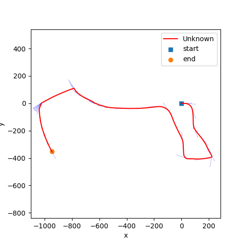
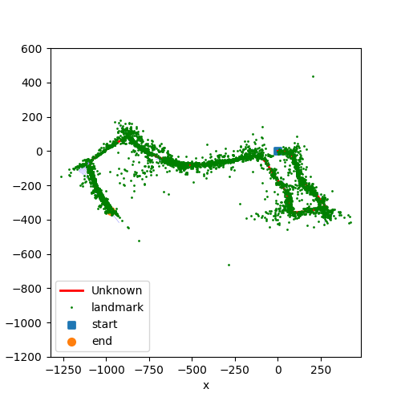

# Visual-Inertial-SLAM

## Setup
install the package specified in requiremnts.txt
extrnal package such as scipy.linalg to perform expm() and numba.njit to speed up the code

To run hw3_main.py: set DEMO = True for a quick desmostration, set DEMO = False for a SLAM algorithm run.

plot_result folder contain the trajectoy and landmark mapping with respect to different number of features

## Dead Reckoning

## Result

